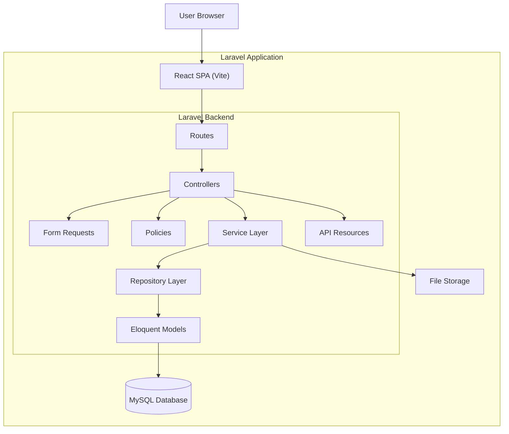
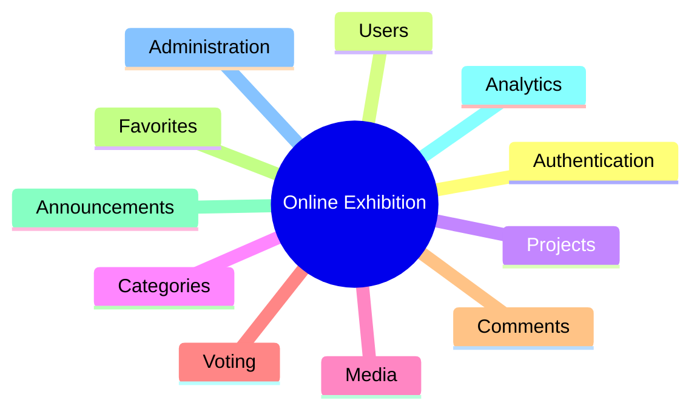

<!-- @format -->

# System Architecture

## Online Exhibition System

### Collaborative Development – Visit Malaysia 2026 (VM2026)

---

# Architecture Overview

The Online Exhibition System adopts a **Modular Monolithic Architecture** implemented using the **Laravel Framework** and **React**.

Although Laravel traditionally follows the Model-View-Controller (MVC) pattern, this project extends MVC into a **Layered Architecture** by separating business logic, data access, validation, authorization, and presentation into dedicated layers.

The frontend is developed using **React** and compiled through **Laravel Vite**, making the application a single deployable unit while maintaining a clear separation between the presentation layer and backend services.

This architecture provides:

- Clear separation of concerns
- Better maintainability
- High scalability
- Easier testing
- Modular feature development
- Support for collaborative software development

---

# Technology Stack

| Layer           | Technology      | Purpose                                                                  |
| --------------- | --------------- | ------------------------------------------------------------------------ |
| Frontend        | React           | Build the Single Page Application (SPA) user interface                   |
| Styling         | Tailwind CSS    | Utility-first CSS framework for responsive and consistent UI development |
| Build Tool      | Vite            | Frontend asset bundler and development server integrated with Laravel    |
| Backend         | Laravel         | Application framework implementing the business logic and RESTful API    |
| Database        | MySQL           | Relational database for storing application data                         |
| Authentication  | Laravel Sanctum | Secure authentication for SPA and API requests                           |
| API             | REST API        | Communication layer between React frontend and Laravel backend           |
| File Storage    | Laravel Storage | Manage uploaded images, documents, posters, and other media files        |
| Version Control | Git             | Source code version control and collaborative development                |

---

# High-Level Architecture



---

# Layer Responsibilities

## 1. Presentation Layer

Responsible for the user interface.

Technology:

- React
- React Router
- Axios
- Tailwind CSS (optional)

Responsibilities:

- Display pages
- Handle user interactions
- Form validation (client-side)
- API communication
- Routing

No business logic should exist in this layer.

---

## 2. Routing Layer

Responsible for routing incoming HTTP requests.

Technology:

- Laravel Routes

Responsibilities:

- Define API endpoints
- Register middleware
- Forward requests to controllers

---

## 3. Controller Layer

Controllers should remain lightweight.

Responsibilities:

- Receive HTTP requests
- Invoke validation
- Check authorization
- Call business services
- Return API responses

Controllers should **never contain business logic**.

---

## 4. Form Request Layer

Handles request validation.

Responsibilities:

- Validate incoming data
- Authorize requests
- Return validation errors

Example:

- StoreProjectRequest
- UpdateProjectRequest

---

## 5. Policy Layer

Responsible for authorization.

Examples:

- Only project owner can edit project
- Only administrator can approve project
- Guests have read-only access

---

## 6. Service Layer

Contains the business logic.

Responsibilities:

- Project creation
- Project approval
- Voting
- Analytics
- Notifications
- Media processing

The service layer acts as the heart of the application.

---

## 7. Repository Layer

Responsible for database interaction.

Responsibilities:

- CRUD operations
- Searching
- Pagination
- Filtering

Repositories isolate Eloquent queries from business logic.

---

## 8. Model Layer

Represents database entities.

Responsibilities:

- Relationships
- Scopes
- Accessors
- Mutators

Business rules should remain inside the Service Layer.

---

## 9. Resource Layer

Responsible for formatting API responses.

Responsibilities:

- Standardize JSON responses
- Hide sensitive fields
- Transform relationships

---

## 10. Storage Layer

Stores uploaded files.

Examples:

- Images
- Posters
- Documentation
- Videos

Laravel Storage provides a unified interface for local or cloud storage.

---

# Request Lifecycle

```mermaid
sequenceDiagram

participant User
participant React
participant Route
participant Controller
participant Request
participant Policy
participant Service
participant Repository
participant Model
participant Database

User->>React: User Action

React->>Route: HTTP Request

Route->>Controller: Route Request

Controller->>Request: Validate Input

Request-->>Controller: Validated Data

Controller->>Policy: Authorization

Policy-->>Controller: Authorized

Controller->>Service: Execute Business Logic

Service->>Repository: Data Operation

Repository->>Model: Eloquent Query

Model->>Database: SQL

Database-->>Model: Result

Model-->>Repository

Repository-->>Service

Service-->>Controller

Controller-->>React: JSON Response

React-->>User: Update Interface
```

---

# Feature-Based Architecture

The application is divided into business modules.



Each module should remain independent while sharing common infrastructure.

---

# Backend Project Structure

```text
app
│
├── Http
│   ├── Controllers
│   │
│   ├── Middleware
│   │
│   ├── Requests
│   │
│   └── Resources
│
├── Models
│
├── Services
│
├── Repositories
│
├── Policies
│
├── Events
│
├── Notifications
│
├── Traits
│
└── Helpers
```

---

# Frontend Project Structure

React is located inside the Laravel project.

```text
resources
│
├── js
│   │
│   ├── app.jsx
│   │
│   ├── pages
│   │
│   ├── layouts
│   │
│   ├── components
│   │
│   ├── features
│   │
│   ├── hooks
│   │
│   ├── contexts
│   │
│   ├── services
│   │
│   ├── routes
│   │
│   ├── utils
│   │
│   └── assets
│
├── css
│
└── views
```

---

# Recommended Feature Structure

Each feature should contain everything related to that domain.

```text
Project
│
├── Backend
│   ├── ProjectController.php
│   ├── ProjectService.php
│   ├── ProjectRepository.php
│   ├── ProjectPolicy.php
│   ├── StoreProjectRequest.php
│   ├── UpdateProjectRequest.php
│   ├── ProjectResource.php
│   └── Project.php
│
└── Frontend
    ├── pages
    │   ├── ProjectList.jsx
    │   ├── ProjectDetail.jsx
    │   └── ProjectForm.jsx
    │
    ├── components
    │   ├── ProjectCard.jsx
    │   ├── ProjectGallery.jsx
    │   └── ProjectStatistics.jsx
    │
    ├── hooks
    │   └── useProjects.js
    │
    ├── services
    │   └── projectApi.js
    │
    └── context
        └── ProjectContext.jsx
```

---

# Root Project Structure

```text
online-exhibition
│
├── app
│
├── bootstrap
│
├── config
│
├── database
│
├── public
│
├── resources
│   ├── css
│   ├── js
│   └── views
│
├── routes
│   ├── web.php
│   └── api.php
│
├── storage
│
├── tests
│
├── vendor
│
├── .env
│
├── artisan
│
├── composer.json
│
├── package.json
│
└── vite.config.js
```

---

# Design Principles

The architecture follows the following software engineering principles:

- **Single Responsibility Principle (SRP)** – Each class has one responsibility.
- **Open/Closed Principle (OCP)** – Modules are open for extension but closed for modification.
- **Dependency Inversion Principle (DIP)** – High-level modules depend on abstractions rather than concrete implementations.
- **Separation of Concerns (SoC)** – Presentation, business logic, and data access are clearly separated.
- **Feature-Based Organization** – Related backend and frontend code is grouped by domain.
- **Modular Monolith** – The system is deployed as a single application while maintaining modular boundaries.

---

# Benefits of the Architecture

- Modern Laravel + React development approach.
- Clear separation between UI, business logic, and persistence.
- Easier maintenance and testing.
- Supports collaborative development by allowing teams to work on independent modules.
- Scalable for future enhancements such as AI recommendations, judge evaluation, commercialization portals, or mobile clients without major architectural changes.
