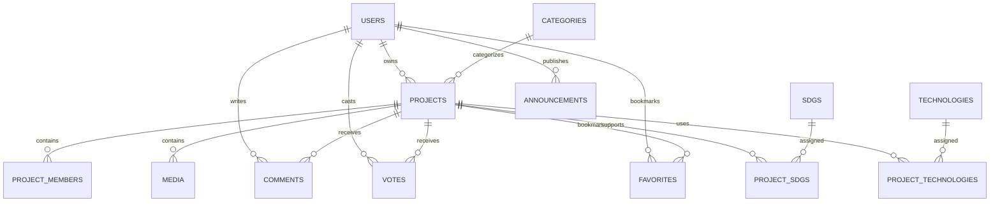

<!-- @format -->

# Entity Relationship Diagram (ERD)

## Online Exhibition System

### Collaborative Development – Visit Malaysia 2026 (VM2026)

---

# Database Overview

The Online Exhibition System is designed using a **relational database model** following the principles of **Third Normal Form (3NF)** to reduce redundancy and maintain data integrity.

The database supports three primary user roles:

- Administrator
- Exhibitor
- Guest

The system focuses on managing exhibition projects, media assets, visitor interactions, and exhibition administration while remaining simple, scalable, and maintainable.

---

# Database Design Principles

The database is designed with the following principles:

- Normalized up to Third Normal Form (3NF)
- Clear separation of entities
- Avoid duplicated information
- Maintain referential integrity through foreign keys
- Follow Laravel naming conventions
- Support future feature expansion
- Keep the schema simple enough for collaborative student development

---

# Entity List

| Entity               | Description                                      |
| -------------------- | ------------------------------------------------ |
| users                | Registered users of the system                   |
| projects             | Student exhibition projects                      |
| project_members      | Members belonging to a project team              |
| categories           | General project classifications                  |
| sdgs                 | Sustainable Development Goals                    |
| project_sdgs         | Junction table linking projects and SDGs         |
| technologies         | Technology stack reference                       |
| project_technologies | Junction table linking projects and technologies |
| media                | Uploaded project media and documents             |
| comments             | Visitor comments and discussions                 |
| votes                | People's Choice voting                           |
| favorites            | User bookmarked projects                         |
| announcements        | Exhibition announcements                         |

---

# Entity Relationship Diagram

---

# Entity Specifications

---

# USERS

## Purpose

Stores all registered users that can access the system.

A user may authenticate using either traditional email/password authentication or Google Social Login.

A user can own multiple exhibition projects.

---

## Attributes

| Field             | Type                      | Description                       |
| ----------------- | ------------------------- | --------------------------------- |
| id                | bigint                    | Primary key                       |
| name              | string                    | Full name                         |
| email             | string                    | Email address                     |
| password          | string (nullable)         | Password for local authentication |
| google_id         | string (nullable, unique) | Google OAuth unique identifier    |
| avatar            | string (nullable)         | Profile image                     |
| biography         | text (nullable)           | User biography                    |
| institution       | string                    | Institution or university         |
| role              | enum                      | Administrator, Exhibitor, Guest   |
| email_verified_at | timestamp                 | Email verification timestamp      |
| remember_token    | string                    | Remember me token                 |
| created_at        | timestamp                 | Created timestamp                 |
| updated_at        | timestamp                 | Updated timestamp                 |

---

## Relationships

- One User owns many Projects
- One User (administrator) reviews many Projects
- One User writes many Comments
- One User casts many Votes
- One User bookmarks many Favorites
- One User publishes many Announcements

---

# PROJECTS

## Purpose

Stores all exhibition projects.

This is the primary entity of the system.

Each project belongs to one exhibitor.

The public exhibition reads only projects whose status is `Published` and whose
`published_at` value has arrived. Opening a public project detail increments the
existing aggregate `views_count`; this is a simple counter, not visitor-level
analytics.

The implemented administration workflow uses only the documented forward
states: `Submitted` → `Under Review` → `Approved` → `Published`. Review actions
write `review_notes`, `reviewed_by`, and `reviewed_at`; publication writes
`published_at`. Reject and Return for Revision are not persisted because the
approved enum defines no matching state.

---

## Attributes

| Field               | Type                 | Description                                         |
| ------------------- | -------------------- | --------------------------------------------------- |
| id                  | bigint               | Primary key                                         |
| user_id             | bigint               | Project owner                                       |
| category_id         | bigint               | Project category                                    |
| title               | string               | Project title                                       |
| subtitle            | string (nullable)    | Optional subtitle                                   |
| team_name           | string (nullable)    | Team / group name                                   |
| slug                | string (unique)      | SEO-friendly URL                                    |
| abstract            | text                 | Project summary                                     |
| problem_statement   | text                 | Identified problem                                  |
| proposed_solution   | text                 | Proposed solution                                   |
| objectives          | text                 | Project objectives                                  |
| target_users        | text                 | Intended users                                      |
| expected_impact     | text                 | Expected benefits                                   |
| methodology         | text                 | Development methodology                             |
| system_architecture | text                 | Architecture overview                               |
| github_url          | string (nullable)    | GitHub repository                                   |
| demo_url            | string (nullable)    | Live system                                         |
| figma_url           | string (nullable)    | Figma prototype                                     |
| video_url           | string (nullable)    | Demonstration video                                 |
| status              | enum                 | Draft, Submitted, Under Review, Approved, Published |
| review_notes        | text (nullable)      | Administrator review feedback                       |
| reviewed_by         | bigint (nullable)    | Reviewing administrator (FK → users)                |
| reviewed_at         | timestamp (nullable) | Review timestamp                                    |
| featured            | boolean              | Featured project                                    |
| views_count         | unsigned integer     | Total project views (default 0)                     |
| published_at        | timestamp (nullable) | Publication date                                    |
| created_at          | timestamp            | Created timestamp                                   |
| updated_at          | timestamp            | Updated timestamp                                   |

---

## Relationships

- Belongs to one User (owner)
- Belongs to one Category
- May be reviewed by one User (administrator, via `reviewed_by`)
- Has many Project Members
- Has many Media
- Has many Comments
- Has many Votes
- Has many Favorites
- Belongs to many SDGs
- Belongs to many Technologies

---

# PROJECT_MEMBERS

## Purpose

Stores all team members associated with a project.

Not every member is required to register an account.

---

## Attributes

| Field         | Type      | Description        |
| ------------- | --------- | ------------------ |
| id            | bigint    | Primary key        |
| project_id    | bigint    | Related project    |
| student_name  | string    | Student name       |
| matric_number | string    | Student ID         |
| programme     | string    | Academic programme |
| supervisor    | string    | Project supervisor |
| created_at    | timestamp | Created timestamp  |
| updated_at    | timestamp | Updated timestamp  |

---

## Relationships

- Belongs to one Project

---

# CATEGORIES

## Purpose

Stores the classification of digital solutions.

Categories describe the **type of digital solution** (for example, Web Application or Mobile Application), not tourism sectors. Tourism relevance is expressed through a project's content and its SDG alignment.

---

## Attributes

| Field       | Type              | Description          |
| ----------- | ----------------- | -------------------- |
| id          | bigint            | Primary key          |
| name        | string            | Category name        |
| description | text              | Category description |
| icon        | string (nullable) | Display icon         |
| created_at  | timestamp         | Created timestamp    |
| updated_at  | timestamp         | Updated timestamp    |

---

## Example Categories

- Web Application
- Mobile Application
- Progressive Web App (PWA)
- Desktop Application
- Artificial Intelligence
- Internet of Things (IoT)
- Data Analytics
- AR / VR
- Game Development
- API / Backend Service
- Digital Platform
- Other

---

## Relationships

- One Category contains many Projects

---

# SDGS

## Purpose

Stores the Sustainable Development Goals supported by the exhibition.

---

## Attributes

| Field       | Type   | Description     |
| ----------- | ------ | --------------- |
| id          | bigint | Primary key     |
| code        | string | SDG code        |
| title       | string | SDG title       |
| description | text   | SDG description |

---

## Initial Records

- SDG 8 – Decent Work and Economic Growth
- SDG 11 – Sustainable Cities and Communities
- SDG 12 – Responsible Consumption and Production

---

## Relationships

- Many SDGs belong to many Projects

---

# PROJECT_SDGS

## Purpose

Associates projects with one or more SDGs.

Allows exhibitors to explain how their project contributes to sustainable development.

---

## Attributes

| Field                    | Type   | Description              |
| ------------------------ | ------ | ------------------------ |
| project_id               | bigint | Related project          |
| sdg_id                   | bigint | Related SDG              |
| contribution_description | text   | Contribution explanation |

---

## Relationships

- Belongs to one Project
- Belongs to one SDG

---

# TECHNOLOGIES

## Purpose

Stores reusable technology tags.

---

## Attributes

| Field      | Type      | Description       |
| ---------- | --------- | ----------------- |
| id         | bigint    | Primary key       |
| name       | string    | Technology name   |
| created_at | timestamp | Created timestamp |
| updated_at | timestamp | Updated timestamp |

---

## Example Technologies

- Laravel
- React
- Tailwind CSS
- MySQL
- Flutter
- Firebase
- Node.js
- Python
- Docker
- TensorFlow

---

## Relationships

- Many Technologies belong to many Projects

---

# PROJECT_TECHNOLOGIES

## Purpose

Associates technologies used by each project.

---

## Attributes

| Field         | Type   | Description        |
| ------------- | ------ | ------------------ |
| project_id    | bigint | Related project    |
| technology_id | bigint | Related technology |

---

## Relationships

- Belongs to one Project
- Belongs to one Technology

---

# MEDIA

## Purpose

Stores all uploaded project assets.

A single table is used for all media types to simplify management.

Presentation slide decks are stored as `document` media (`.ppt` or `.pptx`).
The current project schema intentionally has no external `slides_url`; adding
one requires a separately approved schema change.

---

## Attributes

| Field       | Type              | Description                    |
| ----------- | ----------------- | ------------------------------ |
| id          | bigint            | Primary key                    |
| project_id  | bigint            | Related project                |
| type        | enum              | image, poster, video, document |
| filename    | string            | Original filename              |
| path        | string            | Storage path                   |
| thumbnail   | string (nullable) | Generated WebP thumbnail path  |
| uploaded_at | timestamp         | Upload timestamp               |
| created_at  | timestamp         | Created timestamp              |
| updated_at  | timestamp         | Updated timestamp              |

---

## Supported Types

- Screenshot
- Poster
- Video
- Documentation
- User Manual
- Technical Report
- Presentation Slides

Validated image and raster-poster uploads generate a bounded WebP thumbnail.
PDF posters and non-image media keep `thumbnail` as `null`. The original asset
remains available for full-size viewing or download.

---

## Relationships

- Belongs to one Project

---

# COMMENTS

## Purpose

Allows guests and exhibitors to discuss projects.

Supports threaded discussions.

Phase 5 loads root comments in chronological pages and eager-loads their reply
trees. A reply must belong to the same project discussion as its parent.
Administrator moderation uses the approved schema's existing cascade behavior:
removing a comment removes the complete reply branch beneath it. No
undocumented moderation-status or soft-delete column is added.

---

## Attributes

| Field      | Type              | Description       |
| ---------- | ----------------- | ----------------- |
| id         | bigint            | Primary key       |
| user_id    | bigint            | Comment author    |
| project_id | bigint            | Related project   |
| parent_id  | bigint (nullable) | Parent comment    |
| comment    | text              | Comment content   |
| created_at | timestamp         | Created timestamp |
| updated_at | timestamp         | Updated timestamp |

---

## Relationships

- Belongs to one User
- Belongs to one Project
- May belong to one parent Comment

---

# VOTES

## Purpose

Stores People's Choice voting.

Each user may vote once per project.

---

## Attributes

| Field      | Type      | Description    |
| ---------- | --------- | -------------- |
| id         | bigint    | Primary key    |
| user_id    | bigint    | Voting user    |
| project_id | bigint    | Voted project  |
| created_at | timestamp | Vote timestamp |

---

## Business Rules

- One vote per user per project
- Duplicate votes are prevented using a unique constraint on `(user_id, project_id)`
- A recorded vote is not exposed through a removal endpoint

---

## Relationships

- Belongs to one User
- Belongs to one Project

## Business Rules

- One favorite per user per project
- Duplicate favorites are prevented using a unique constraint on `(user_id, project_id)`
- Adding an existing favorite is idempotent

---

# FAVORITES

## Purpose

Allows users to bookmark projects for future viewing.

---

## Attributes

| Field      | Type      | Description        |
| ---------- | --------- | ------------------ |
| id         | bigint    | Primary key        |
| user_id    | bigint    | User               |
| project_id | bigint    | Bookmarked project |
| created_at | timestamp | Created timestamp  |

---

## Relationships

- Belongs to one User
- Belongs to one Project

---

# ANNOUNCEMENTS

## Purpose

Stores exhibition news and announcements displayed on the homepage.

Announcements may be scheduled. Public homepage queries include only records
whose `published_at` timestamp has arrived, ordered newest first. The
Administrator management workflow can create, edit, list, and delete both due
and future records.

---

## Attributes

| Field        | Type      | Description           |
| ------------ | --------- | --------------------- |
| id           | bigint    | Primary key           |
| user_id      | bigint    | Administrator         |
| title        | string    | Announcement title    |
| content      | text      | Announcement body     |
| published_at | timestamp | Publication timestamp |
| created_at   | timestamp | Created timestamp     |
| updated_at   | timestamp | Updated timestamp     |

---

## Relationships

- Belongs to one User (Administrator)

---

# Relationship Summary

| Parent   | Child          | Relationship |
| -------- | -------------- | ------------ |
| User     | Project        | One-to-Many  |
| User (reviewer) | Project | One-to-Many  |
| Category | Project        | One-to-Many  |
| Project  | Project Member | One-to-Many  |
| Project  | Media          | One-to-Many  |
| User     | Comment        | One-to-Many  |
| Project  | Comment        | One-to-Many  |
| User     | Vote           | One-to-Many  |
| Project  | Vote           | One-to-Many  |
| User     | Favorite       | One-to-Many  |
| Project  | Favorite       | One-to-Many  |
| User     | Announcement   | One-to-Many  |
| Project  | SDG            | Many-to-Many |
| Project  | Technology     | Many-to-Many |

---

# Database Constraints

The following constraints should be enforced:

- Email must be unique.
- Google ID must be unique.
- Project slug must be unique.
- One vote per user per project.
- One favorite per user per project.
- `views_count` defaults to `0`.
- `reviewed_by` references `users.id` and is nullable (set only once a project has been reviewed); it should be set to `NULL` if the reviewing user is deleted.
- Foreign keys must enforce referential integrity.
- Cascade delete should be used where appropriate (e.g., deleting a project removes its media, members, comments, votes, favorites, and pivot records).
- Deleting a parent comment cascades to every reply beneath that comment.
- Announcement `published_at` should be indexed for due-item homepage queries
  when the database platform allows the schema change safely.

## PlanetScale Production Note

The current production database is hosted on PlanetScale/Vitess, which rejects
physical foreign key constraints. Production migrations therefore create the
relationship ID columns and correctness-critical unique constraints, but do not
create database-level foreign keys. Non-unique performance indexes should be
added separately only after validating the PlanetScale deployment path.
Relationship integrity and cascade behavior must be enforced through Laravel
services, policies, and Eloquent model operations when using this production
platform.

---

# Future Expansion

The database is intentionally designed for extensibility. A simple project view counter is already
supported via `projects.views_count`; the richer visitor-analytics features below remain future work.

Future enhancements may include:

- Judge management and evaluation
- Awards and certificates
- Sponsor management
- QR code generation for project pages
- AI-powered project recommendations
- Live exhibition sessions
- Advanced visitor analytics (per-visit tracking, referral sources, daily/monthly trends, session data)
- Commercialization and industry collaboration modules

The current schema provides a stable foundation for these features without requiring major structural changes.
